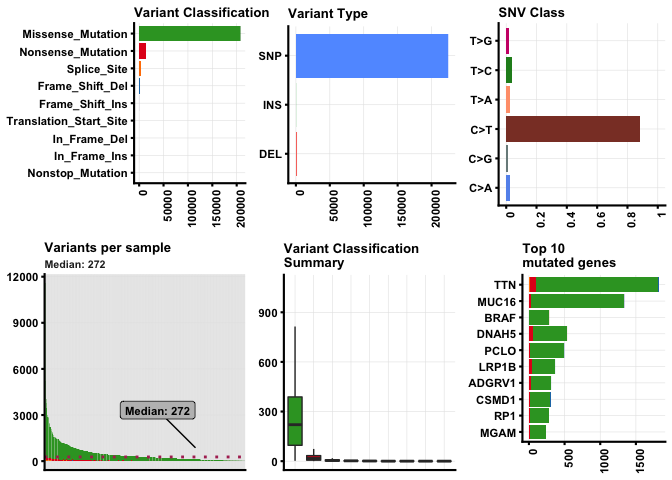
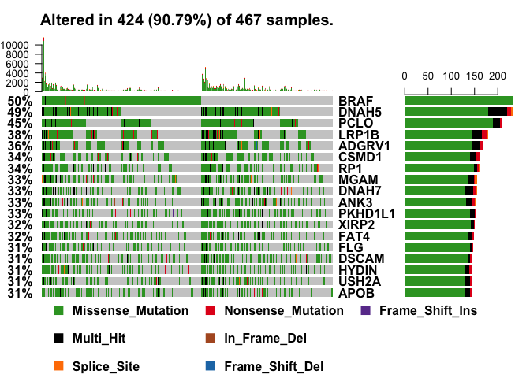
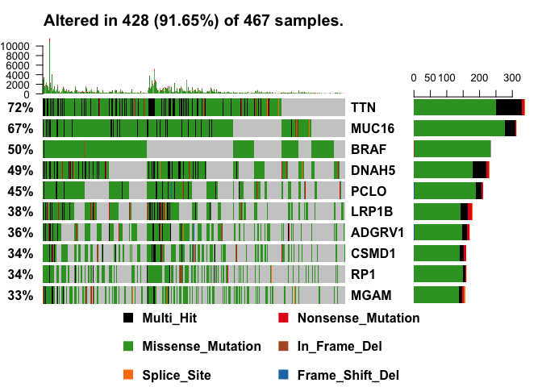
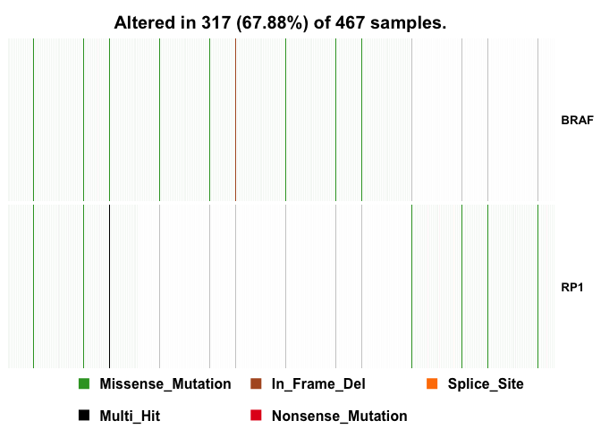
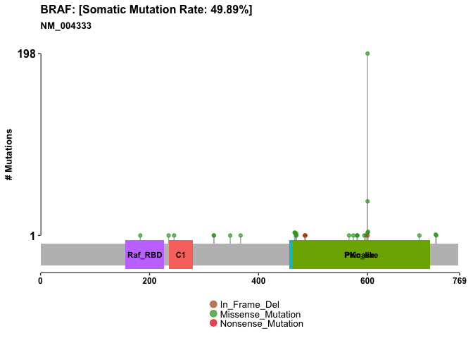

Investigating cancer genomics datasets
================

Cancer is fundamentally a disease of the genome, caused by changes in the DNA, RNA, and proteins of a cell that push cell growth into overdrive. Identifying the genomic alterations that arise in cancer can help researchers decode how cancer develops and improve upon the diagnosis and treatment of cancers based on their distinct molecular abnormalities.

The increased availability of genome sequencing is having an enormous impact on the study and treatment of cancer. This is important because it is estimated that cancer will strike 40% of people at some point in their lifetime with frequently devastating effects.

With the ability to sequence whole genomes and exomes, attention has turned to trying to understand the full spectrum of genetic mutations that underlie cancer. The genomes or exomes of tens of thousands of cancers have now been sequenced. Analyzing this data can yield important new insights into cancer biology.

Genomics

-   **Mutations** - The GDC provides access to DNA sequence data and generates associated Variant Calling Format (VCF) and Mutation Annotation Format (MAF) files that identify somatic mutations such as point mutations, missense mutations, nonsense mutations, and insertions and deletions (indels) of nucleotides in the DNA.
-   **Copy Number Variants** - The GDC provides access to Copy Number Variation (CNV) data to identify amplified and attentuated gene expression due to chromosomal duplications, loss, insertions and deletions.
-   **Expression Quantification** - The GDC provides access to mRNA and miRNA sequence data and quantifies gene and miRNA expression using standardized software pipelines; expression values are provided in simple tab-separated value format.
-   **Post-transcriptional Modifications** - The GDC provides access to mRNA sequence data to assist in identifying post-transcriptional splice modifications that are manifested as splice junction and isoform variants.

This session highlights how one can leverage two Bioconductor packages [GenomicDataCommons](https://bioconductor.org/packages/release/bioc/html/GenomicDataCommons.html) and [maftools](https://bioconductor.org/packages/release/bioc/html/maftools.html) to quickly gain insight into public cancer genomics datasets.

The National Cancer Institute (NCI) in the US has established the **Genomic Data Commons** (or **GDC** for short) for sharing cancer genomics datasets. This includes data from the large scale Cancer Genome Atlas (TCGA) and Therapeutically Applicable Research to Generate Effective Therapies (TARGET) projects. The `GenomicDataCommons` Bioconductor package provides functions for querying, accessing, and mining this rich data source. In essence, this allows us to bring cancer genomics data to the plethora of state-of-the-art bioinformatics methods available in Bioconductor.

The maftools package has a [nice online vignette](https://bioconductor.org/packages/release/bioc/vignettes/maftools/inst/doc/maftools.html)

Overview
--------

Here we demonstrate the use of the Bioconductor GenomicDataCommons package to identify and then fetch somatic variant results from the NCI GDC and then provide a high-level assessment of those variants using the maftools package.

The workflow will be:

-   Install packages if not already installed
-   Load libraries
-   Identify and download somatic variants for a representative TCGA dataset, in this case cutaneous melanoma.
-   Use maftools to provide rich summaries of the data.

``` r
source("https://bioconductor.org/biocLite.R")
biocLite(c("GenomicDataCommons", "maftools"))
```

Once installed, load the packages, as usual.

``` r
library(GenomicDataCommons)
```

    ## Warning: package 'GenomicDataCommons' was built under R version 3.4.2

    ## Loading required package: magrittr

    ## 
    ## Attaching package: 'GenomicDataCommons'

    ## The following object is masked from 'package:stats':
    ## 
    ##     filter

``` r
library(maftools)
```

    ## Warning: package 'maftools' was built under R version 3.4.3

Now lets check on GDC status:

``` r
GenomicDataCommons::status()
```

    ## $commit
    ## [1] "5b0e778f1d25f01a38b2c532f52c80527d57da1b"
    ## 
    ## $data_release
    ## [1] "Data Release 10.1 - February 15, 2018"
    ## 
    ## $status
    ## [1] "OK"
    ## 
    ## $tag
    ## [1] "1.13.0"
    ## 
    ## $version
    ## [1] 1

Examining available values in the GDC

``` r
available_values(entity='files', field='analysis.workflow_type')
```

    ##  [1] "DNAcopy"                                      
    ##  [2] "BCGSC miRNA Profiling"                        
    ##  [3] "BWA with Mark Duplicates and Cocleaning"      
    ##  [4] "FM Simple Somatic Mutation"                   
    ##  [5] "FoundationOne Annotation"                     
    ##  [6] "Liftover"                                     
    ##  [7] "STAR 2-Pass"                                  
    ##  [8] "HTSeq - Counts"                               
    ##  [9] "HTSeq - FPKM"                                 
    ## [10] "HTSeq - FPKM-UQ"                              
    ## [11] "BWA-aln"                                      
    ## [12] "SomaticSniper"                                
    ## [13] "SomaticSniper Annotation"                     
    ## [14] "MuTect2"                                      
    ## [15] "MuTect2 Annotation"                           
    ## [16] "VarScan2"                                     
    ## [17] "VarScan2 Annotation"                          
    ## [18] "MuSE"                                         
    ## [19] "MuSE Annotation"                              
    ## [20] "MuSE Variant Aggregation and Masking"         
    ## [21] "MuTect2 Variant Aggregation and Masking"      
    ## [22] "SomaticSniper Variant Aggregation and Masking"
    ## [23] "VarScan2 Variant Aggregation and Masking"     
    ## [24] "FoundationOne Variant Aggregation and Masking"
    ## [25] "_missing"

The first arugument to this function, `entity` can be one of either "cases", "files", "annotations", or "projects".

``` r
# Data types
available_values('files','data_type')
```

    ##  [1] "Annotated Somatic Mutation"       
    ##  [2] "Raw Simple Somatic Mutation"      
    ##  [3] "Aligned Reads"                    
    ##  [4] "Gene Expression Quantification"   
    ##  [5] "Copy Number Segment"              
    ##  [6] "Masked Copy Number Segment"       
    ##  [7] "Methylation Beta Value"           
    ##  [8] "Isoform Expression Quantification"
    ##  [9] "miRNA Expression Quantification"  
    ## [10] "Biospecimen Supplement"           
    ## [11] "Clinical Supplement"              
    ## [12] "Aggregated Somatic Mutation"      
    ## [13] "Masked Somatic Mutation"

``` r
# Data formats
available_values('files','data_format')
```

    ## [1] "VCF"     "TXT"     "BAM"     "TSV"     "BCR XML" "MAF"     "XLSX"

``` r
# Analysis workflows
available_values('files','analysis.workflow_type')
```

    ##  [1] "DNAcopy"                                      
    ##  [2] "BCGSC miRNA Profiling"                        
    ##  [3] "BWA with Mark Duplicates and Cocleaning"      
    ##  [4] "FM Simple Somatic Mutation"                   
    ##  [5] "FoundationOne Annotation"                     
    ##  [6] "Liftover"                                     
    ##  [7] "STAR 2-Pass"                                  
    ##  [8] "HTSeq - Counts"                               
    ##  [9] "HTSeq - FPKM"                                 
    ## [10] "HTSeq - FPKM-UQ"                              
    ## [11] "BWA-aln"                                      
    ## [12] "SomaticSniper"                                
    ## [13] "SomaticSniper Annotation"                     
    ## [14] "MuTect2"                                      
    ## [15] "MuTect2 Annotation"                           
    ## [16] "VarScan2"                                     
    ## [17] "VarScan2 Annotation"                          
    ## [18] "MuSE"                                         
    ## [19] "MuSE Annotation"                              
    ## [20] "MuSE Variant Aggregation and Masking"         
    ## [21] "MuTect2 Variant Aggregation and Masking"      
    ## [22] "SomaticSniper Variant Aggregation and Masking"
    ## [23] "VarScan2 Variant Aggregation and Masking"     
    ## [24] "FoundationOne Variant Aggregation and Masking"
    ## [25] "_missing"

``` r
available_values('files','cases.project.project_id')
```

    ##  [1] "FM-AD"       "TCGA-BRCA"   "TCGA-LUAD"   "TCGA-UCEC"   "TCGA-LUSC"  
    ##  [6] "TCGA-HNSC"   "TCGA-LGG"    "TCGA-THCA"   "TCGA-OV"     "TCGA-PRAD"  
    ## [11] "TCGA-COAD"   "TCGA-SKCM"   "TCGA-KIRC"   "TCGA-STAD"   "TCGA-BLCA"  
    ## [16] "TCGA-GBM"    "TCGA-LIHC"   "TCGA-CESC"   "TCGA-KIRP"   "TCGA-SARC"  
    ## [21] "TCGA-ESCA"   "TARGET-NBL"  "TCGA-PAAD"   "TCGA-PCPG"   "TCGA-READ"  
    ## [26] "TCGA-LAML"   "TCGA-TGCT"   "TCGA-THYM"   "TARGET-AML"  "TCGA-ACC"   
    ## [31] "TARGET-WT"   "TCGA-MESO"   "TCGA-UVM"    "TCGA-KICH"   "TCGA-UCS"   
    ## [36] "TCGA-CHOL"   "TCGA-DLBC"   "TARGET-OS"   "TARGET-RT"   "TARGET-CCSK"

If this statement results in an error such as `SSL connect error`, then please see the [troubleshooting section here](https://bioconductor.org/packages/release/bioc/vignettes/GenomicDataCommons/inst/doc/overview.html#ssl-connection-errors).

Finding data
------------

The following code builds a `manifest` that can be used to guide the download of raw data. Here, filtering finds gene expression files quantified as raw counts using `HTSeq` from ovarian cancer patients.

Each file in the GDC is identified by a "**UUID**" that carries no meaning other than it is unique. TCGA barcodes are not directly used for identifying files, though filtering files by TCGA barcodes is possible (and not shown here). So, the first step is to find barcodes associated with a \[MAF format file\] for TCGA project “TCGA-SKCM”. Searching based on data\_type, data\_format, and analysis.workflow\_type will limit results to the file of interest, namely the MuTect2 workflow variant calls, converted to MAF format.

``` r
uuids <- files() %>%
  GenomicDataCommons::filter(~ cases.project.project_id == "TCGA-SKCM" &
    data_type == "Masked Somatic Mutation" &
    data_format == "MAF" &
    analysis.workflow_type == "MuTect2 Variant Aggregation and Masking") %>%
  ids()

uuids
```

    ## [1] "4b7a5729-b83e-4837-9b61-a6002dce1c0a"

Once the uuids have been identified (in this case, only 4b7a5729-b83e-4837-9b61-a6002dce1c0a), the gdcdata() function downloads the associated files and returns a filename for each uuid.

``` r
maffile = gdcdata(uuids)
maffile
```

    ##                                                                                                                        4b7a5729-b83e-4837-9b61-a6002dce1c0a 
    ## "/var/folders/xf/qznxnpf91vb1wm4xwgnbt0xr0000gn/T//RtmpNGtARz/file55e094d950b/TCGA.SKCM.mutect.4b7a5729-b83e-4837-9b61-a6002dce1c0a.DR-10.0.somatic.maf.gz"

The MAF file is now stored locally and the maftools package workflow, which starts with a MAF file, can proceed, starting with reading the melanoma MAF file.

``` r
melanoma_vars = read.maf(maf = maffile, verbose = FALSE)
```

    ## reading maf..

    ## 
    Read 0.0% of 392571 rows
    Read 17.8% of 392571 rows
    Read 38.2% of 392571 rows
    Read 48.4% of 392571 rows
    Read 71.3% of 392571 rows
    Read 86.6% of 392571 rows
    Read 89.2% of 392571 rows
    Read 392571 rows and 120 (of 120) columns from 0.504 GB file in 00:00:13

    ## Done !

With the data available as a maftools MAF object, a lot of functionality is available with little code. While the maftools package offers quite a few functions, here are a few highlights. Cancer genomics and bioinformatics researchers will recognize these plots:

### Plotting MAF summary.

We can use `plotmafSummary()` function to plot a summary of the maf object, which displays number of variants in each sample as a stacked barplot and variant types as a boxplot summarized by Variant\_Classification. We can add either mean or median line to the stacked barplot to display average/median number of variants across the cohort.

``` r
plotmafSummary(maf = melanoma_vars, rmOutlier = TRUE,
               addStat = 'median', dashboard = TRUE,
               titvRaw = FALSE)
```

    ## Warning: Removed 43 rows containing non-finite values (stat_boxplot).



### Drawing oncoplots

Better representation of maf file can be shown as oncoplots, also known as waterfall plots. Oncoplot function uses `ComplexHeatmap()` to draw oncoplots \[ref\]. To be specific, oncoplot is a wrapper around ComplexHeatmap’s `OncoPrint()` function with little modification and automation which makes plotting easier. Side barplot and top barplots can be controlled by `drawRowBar()` and `drawColBar()` arguments respectively.

``` r
# exclude a couple of "noise" genes--common practice, unfortunately
oncoplot(maf = melanoma_vars, top = 15, fontSize = 12,
         genes = getGeneSummary(melanoma_vars)$Hugo_Symbol[3:20])
```



Not sure if this shows up or not?

``` r
#We will draw oncoplots for top ten mutated genes.
oncoplot(maf = melanoma_vars, top = 10, fontSize = 12)
```



> **NOTE**: Variants annotated as Multi\_Hit are those genes which are mutated more than once in the same sample.

We can visualize any set of genes using oncostrip function, which draws mutations in each sample similar to OncoPrinter tool on cBioPortal. oncostrip can be used to draw any number of genes using top or genes arguments

``` r
oncostrip(maf=melanoma_vars, genes=c("BRAF", "RP1"))
```



Another plot focussing on BRAF

``` r
braf.lpop = lollipopPlot(maf = melanoma_vars, gene = 'BRAF',
                           AACol = 'HGVSp_Short', showMutationRate = TRUE,
                           domainLabelSize = 3, defaultYaxis = FALSE)
```



Additional functionality is available for both the GenomicDataCommons and maftools packages. This session highlights how one can leverage two Bioconductor packages to quickly gain insight into public cancer genomics datasets.

Other analysis workflows:
-------------------------

``` r
available_values('files','analysis.workflow_type')
```

    ##  [1] "DNAcopy"                                      
    ##  [2] "BCGSC miRNA Profiling"                        
    ##  [3] "BWA with Mark Duplicates and Cocleaning"      
    ##  [4] "FM Simple Somatic Mutation"                   
    ##  [5] "FoundationOne Annotation"                     
    ##  [6] "Liftover"                                     
    ##  [7] "STAR 2-Pass"                                  
    ##  [8] "HTSeq - Counts"                               
    ##  [9] "HTSeq - FPKM"                                 
    ## [10] "HTSeq - FPKM-UQ"                              
    ## [11] "BWA-aln"                                      
    ## [12] "SomaticSniper"                                
    ## [13] "SomaticSniper Annotation"                     
    ## [14] "MuTect2"                                      
    ## [15] "MuTect2 Annotation"                           
    ## [16] "VarScan2"                                     
    ## [17] "VarScan2 Annotation"                          
    ## [18] "MuSE"                                         
    ## [19] "MuSE Annotation"                              
    ## [20] "MuSE Variant Aggregation and Masking"         
    ## [21] "MuTect2 Variant Aggregation and Masking"      
    ## [22] "SomaticSniper Variant Aggregation and Masking"
    ## [23] "VarScan2 Variant Aggregation and Masking"     
    ## [24] "FoundationOne Variant Aggregation and Masking"
    ## [25] "_missing"
